# Foundation6
Sheldon  
November 29, 2015  
이번에는 R을 이용해서 그래프를 작성하는 방법을 간략히 소개하겠습니다. R에는 고수준 작도함수와 저수준 작도함수가 있다고 합니다. 고수준 작도함수는 하나의 완성된 그래프를 그리는 것이고 저수준 작도함수는 그 완성된 그래프에 선을 덧붙이거나 점을 찍어서 그 그래프를 장식하는 역할을 합니다.

가장 대표적인 고수준 작도함수인 plot()을 이용해서 그래프를 그려 봅시다. R에서 그래프를 그리기 위해서는 우선 그래프를 그리기 위한 데이터가 필요합니다. 만약 하나의 벡터만을 이용할경우 그 벡터의 값들은 y축으로 가고 x축의 값은 자동적으로 index인 1, 2, 3, …, 이 됩니다.

```r
y<-c(1:6)
plot(y)
```

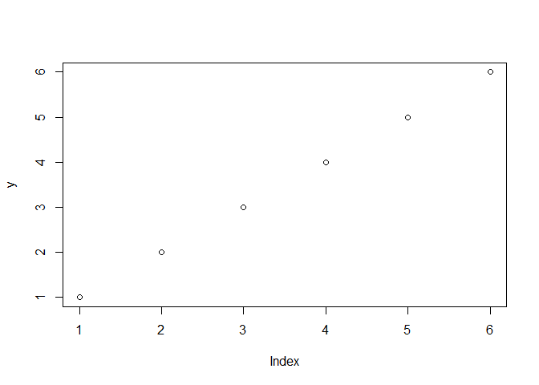 

그리고 만약 2개의 벡터를 plot()의 인수로 한 다면 첫 번째 벡터는 x축, 두 번째 벡터는 y축 데이터가 됩니다.


```r
x<-3:8
plot(x,y)
```

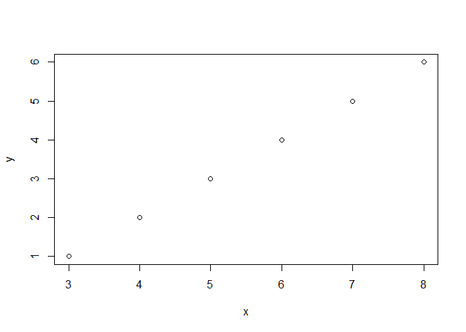 

3:8은 x축에 1:6은 y축에 있죠.

수학함수를 지정해서 그 함수의 해당 그래프를 출력할 수도 있습니다.


```r
plot(cos)
```

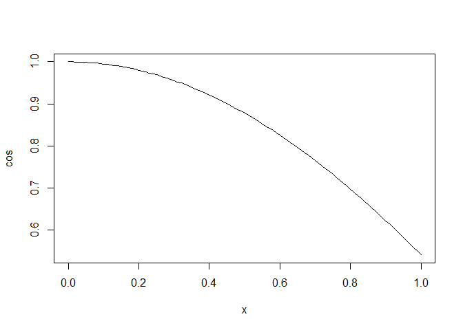 

위와 같은 방식으로 하면 R이 출력 범위를 자동으로 정해서 그래프를 출력합니다. 출력 범위를 조절하려면 plot의 인수 xlim과 ylim을 이용하면 됩니다. 만약 plot(x, xlim=c(0,10)) 이라면 x축의 범위를 0에서 10까지로 지정한 것이죠. ylim도 마찬가지고요.


```r
plot(cos, xlim=c(-2*pi, 2*pi))
```

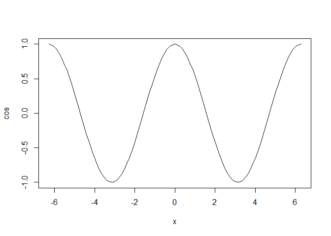 

그리고 그래프에 제목을 붙이려면 main()인수를, x축과 y축에 대한 라벨을 붙이려면 xlab(), ylab()을 각각 사용합니다.


```r
plot(cos, xlim=c(-2*pi, 2*pi),main="cosine function", xlab="x axis", ylab="y axis")
```

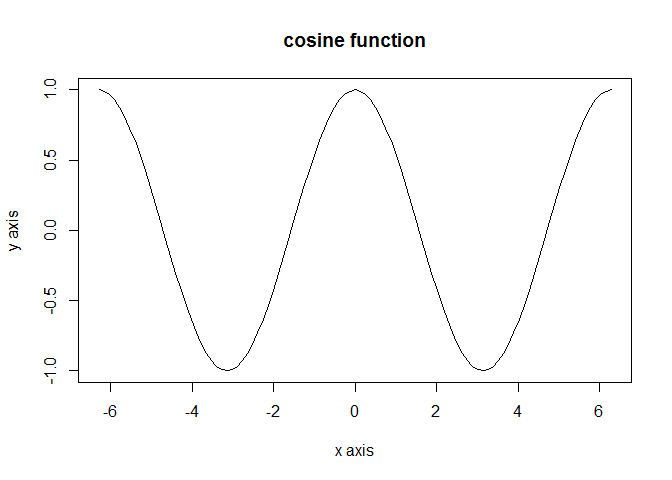 

점들을 그래프로 그릴 때 그 점들을 선으로 잇고 싶으면 type=“l”을 지정해 주면 됩니다. 플롯할 점의 형식에는 이것말고 여러가지가 있으니까 꼭 찾아보세요.


```r
plot(x,y)
```

 

```r
plot(x, y, type="l")
```

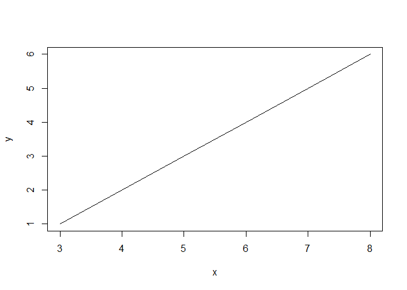 

col인수를 이용하면 색상을 바꿀 수 있습니다.


```r
plot(x, y, type="l",col="2")
```

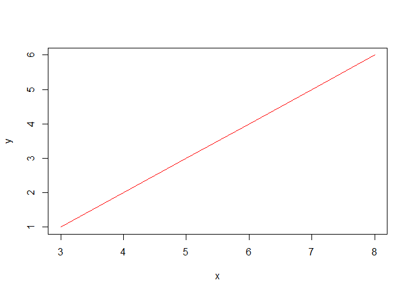 

그 밖에도 그래프를 조절할 수 있는 인수가 아주 많이 있습니다. 도움말과 구글링을 통해서 더 알아보고 나만의 그래프를 꾸며 보세요.

다음에는 완성된 그래프에 선을 추가하는 방법에 대해서 알아 봅시다. lines()를 이용하면 곡선을 추가할 수 있습니다.


```r
plot(x, y, type="l",col="2",xlim=c(0,10))
lines(c(1,2),c(2,1))  #이렇게 하면 (1,2)와 (2,1)을연결하는 직선을 그립니다.
```

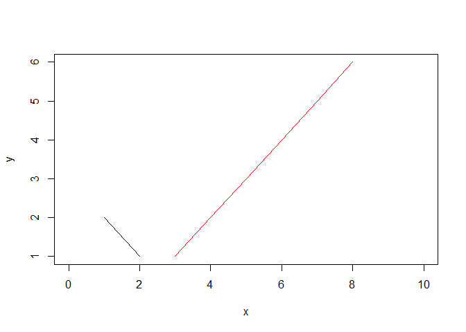 

곡선을 그려볼까요?


```r
plot(x,y,xlim=c(-5,10),ylim=c(-2,8))
x2<-seq(-2,6,by=0.01)#이렇게 등차가 아주 작은 수열을 만듭니다.
lines(x2,sin(x2),type="l")#이렇게 차이가 작은 점들을 직선으로 연결하면 곡선처럼 됩니다. 
```

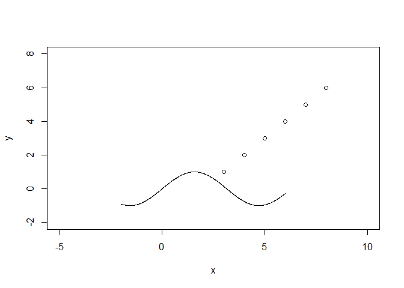 

위와 같은 방식으로 그릴 수도 있지만 사실 curve 함수를 쓰는 게 더 편합니다. 다만 이건 고수준 작도함수라서 기존의 그래프에 선을 추가하는 것이 아니라 새로운 그래프가 생성되지요.


```r
curve(sin,-2,2) #x축의 범위가 -2에서 2까지라는 얘기입니다.
```

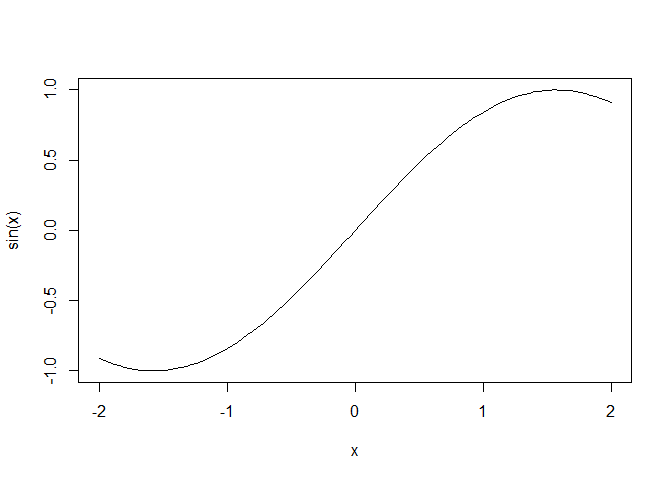 

abline()은 직선을 그리는 저수준 함수입니다. abline(a=0, b=1)를 입력하면 절편이 0, 기울기가 1인 직선을 그립니다.


```r
plot(x,y)
abline(a=0,b=1)
```

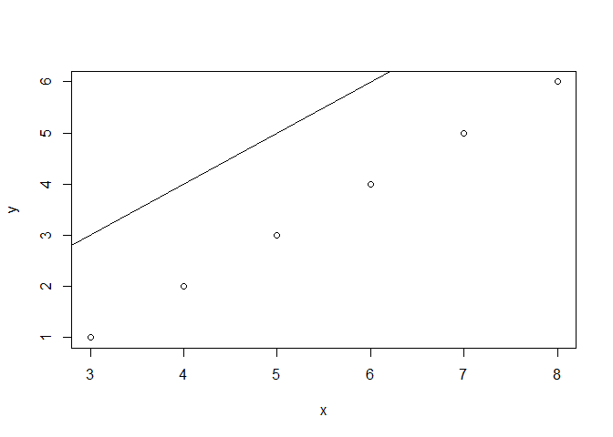 

abline(h=y)라고 하면 (0,y)를 지나는 가로선을 그립니다. abline(v=x)라고 하면 (x,0)을 지나는 세로선을 그립니다.


```r
plot(x,y)
abline(h=4)
abline(v=5,col=3)
```

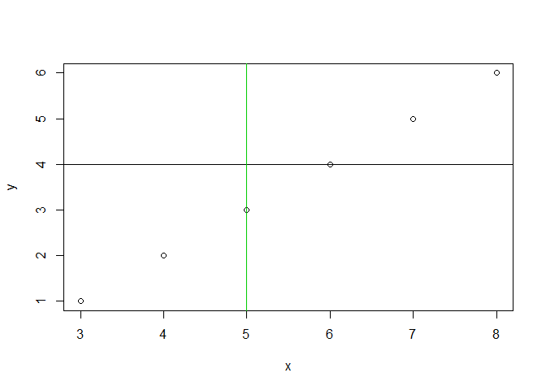 

이것 말고도 그래프를 꾸미는 수많은 옵션들이 R 존재합니다. 패키지가 뭔지 앞으로 소개하겠지만 그래픽스에 관한 패키지도 R에는 여러 개가 있습니다.(패키지는 확장팩 뭐 그런 개념으로 이해하면 더 와닿을 겁니다.) 그래픽스는 R이 다른 통계패키지에 비해 가지는 뛰어난 장점 중 하나입니다. 여러 그래프를 옵션을 달리해서 그려보세요.
